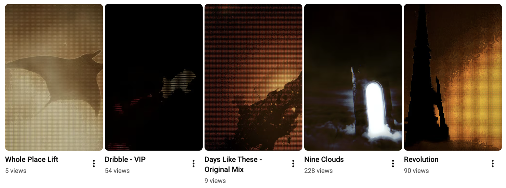

# Homogenisation — the evidence ledger

The collection phase for the roadmap's Homogenisation slice ([ROADMAP.md](./ROADMAP.md) § Homogenisation — the operator calls the phenomenon "Homogenisis"): Fluncle's generated artifacts drift toward a mean, and an archive whose every artifact rhymes with its neighbours reads as machine-made — the one thing the persona cannot afford. The operator's ruling (2026-07-13): **collect evidence first, address it properly later.** This file is where occurrences land as they are seen, so the eventual design pass starts from a real corpus of failures rather than a vibe.

## How to add an entry

One dated entry per observed occurrence: the artifact family (notes / observations / videos / covers / sprites / logbook / captions), what specifically repeats (a palette, a texture, a phrase, a structure), how many of how many artifacts it touches, and — when a metric exists — the measured number. Screenshots go in [assets/](./assets/). An entry is evidence, not a fix; counter-measures that already exist are noted so the ledger stays honest about what is and is not already handled.

## The ledger

### 2026-07-13 · Videos — 4 of 5 consecutive renders share palette AND texture (operator-observed)

Five consecutive YouTube Shorts, in publish order: Whole Place Lift, Dribble - VIP, Days Like These, Nine Clouds, Revolution. **Four of the five share (almost) the same amber/sepia palette and the exact same halftone/scanline texture; Nine Clouds is the only deviation** (cooler palette, volumetric cloud material, no halftone). Whatever the per-render briefs asked for, the generator converged on one look — the attractor is visible at a glance on the channel page, which is exactly where a viewer sees the videos side by side.

Existing counter-measure that did NOT prevent this: the video work's diversity law ("assign each agent a distinct structural family at launch") governs parallel batch renders — these are sequential per-finding renders through the same prompt, so the law never applied. No texture/palette-distance metric exists for videos yet.

### 2026-07-12 · Observations — three stock moves across most of the corpus (measured)

Measured over the 60 live observation scripts (the taste-pack run, `apps/web/scripts/measure-artifact-diversity.ts`): **"hope" in 50/60, "cosmonaut" in 38/60, "shoulders" in 22/60**. Worst pair (Monrroe / Muffler) shares **56%** of content words, including the line "my shoulders went before I'd clocked the coordinate" **verbatim in both**. Three candidate fix directions captured in the taste pack (port the notes' neighbourhood rail / assigned angle families / one-owned-detail rule) — awaiting the operator's pick.

### 2026-07-11 · Notes — the finding that named the property (measured)

The word **"shoulders" in 15/61** live notes; "I've been rewinding it since" lifted verbatim between two findings; the un-layered auto-note reproduced a standing GLXY note almost word for word. Counter-measure ALREADY SHIPPED: the vibe-neighbour layer + echo gate (the model is handed the neighbourhood's moves as spent), which measurably reduced within-region overlap **0.041 → 0.015** (`scoreNoteEcho` + the `--dry-run` harness keep the claim falsifiable). The notes are the one family with a working metric AND a working counter-measure — the template for the rest.

### 2026-07 (standing) · Videos — the attractor law from the overhaul runs

Learned during the video-overhaul and batch-render runs, written down before this ledger existed: **parallel generation converges on a shared attractor, so diversity has to be DESIGNED IN, not hoped for** — assign each agent a distinct structural family at launch; prescriptive mid-flight coaching increases convergence rather than fixing it. The 2026-07-13 entry above shows the sequential form of the same property.

## What the ledger still wants

- **A metric per family.** Notes have `scoreNoteEcho`; observations have the taste-pack word counts; videos, covers, and sprites have nothing — a palette-histogram + texture-family tag per render would have caught the 07-13 strip automatically. "An anti-sameness effort with no metric is folklore" (ROADMAP).
- **Entries from families not yet observed** (covers, sprites, logbook entries, clip captions) — absence of evidence there is so far just absence of looking.
