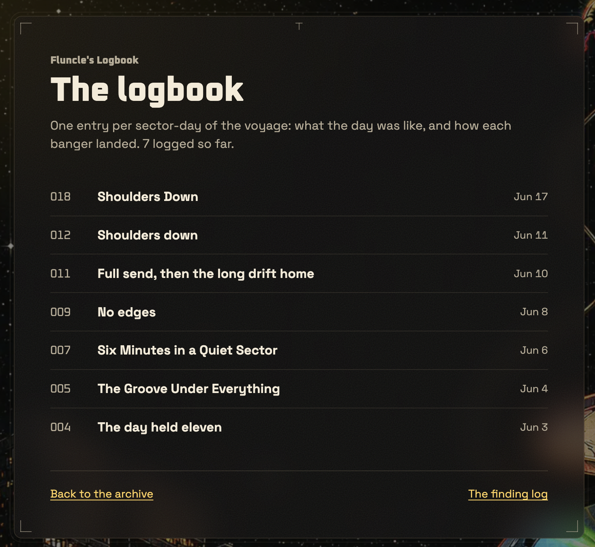

# Homogenisation — the evidence ledger

The collection phase for the roadmap's Homogenisation slice ([ROADMAP.md](./ROADMAP.md) § Homogenisation — the operator calls the phenomenon "Homogenisis"): Fluncle's generated artifacts drift toward a mean, and an archive whose every artifact rhymes with its neighbours reads as machine-made — the one thing the persona cannot afford. The operator's ruling (2026-07-13): **collect evidence first, address it properly later.** This file is where occurrences land as they are seen, so the eventual design pass starts from a real corpus of failures rather than a vibe.

## How to add an entry

One dated entry per observed occurrence: the artifact family (notes / observations / videos / covers / sprites / logbook / captions), what specifically repeats (a palette, a texture, a phrase, a structure), how many of how many artifacts it touches, and — when a metric exists — the measured number. Screenshots go in [assets/](./assets/). An entry is evidence, not a fix; counter-measures that already exist are noted so the ledger stays honest about what is and is not already handled.

## The ledger

### 2026-07-18 · Observations — the REPAIR BATCH (36 re-renders, −67% echoing pairs), and the second-order attractor it exposed

The pre-rail observation corpus was repaired in place (operator-approved): the worst offenders re-authored under the rails and force re-rendered (`observe_track --force`), selected by greedy cover over the echo graph (the gate's own `scoreNoteEcho`, pairwise over all 78 stored scripts, computed from the public `observation.json` corpus).

- **The numbers: 327 → 108 echoing pairs (−67%) across two passes.** Pass 1 (the top-26 cover, each author handed its actual worst lexical partners as spent): 327 → 173, every verbatim sentence lift gone ("my shoulders went before I'd clocked the coordinate", "night side of the crew"), the "…enjoy cosmonauts" tail 33 → 24. Pass 2 (10 heads of the residual graph): 173 → 108, top offender down from 24 edges to 11. All 36 renders accepted first-attempt — zero echo-gate bounces, zero wasted Cartesia spend.
- **The second-order finding: a same-model repair batch converges on its OWN attractor.** Pass 1's fresh scripts independently reconverged on new shared moves — "put it on when…" as the hand-off in ~7 of 26, plus "about a minute in" and "and you can hear" — without ever seeing each other (each author saw only its old script's partners; the server echo gate checks sonic neighbours only). The standing law's text-family form, one layer down: repairing sameness with one model in one register REGROWS sameness unless the fresh siblings are also designed against.
- **Pre-spending one move is not enough.** Pass 2 handed each author its worst current lift through the rejected-move channel — and one render still closed on "put it on when…" with a different move pre-spent. The phrase is a genuine model attractor in this register, so the durable fix is structural, not another pass: the `observation_script` prompt (registry default + baked fallback, lockstep) now names "put it on when…" / "and you can hear…" / "about a minute in" as worn through, the same counter-measure that broke the "enjoy, cosmonauts" formula.
- **Evidence for the parked self-updating-blocklist candidate:** a brand-new crutch emerged within ONE batch — exactly the drift the static worn-list cannot see. Still parked (the harness re-run is the watch), but the candidate's premise is now observed, not hypothesised.
- **The floor is real:** the residual 108 pairs include the ratified "that's a banger" signature and genuine register overlap across one persona — the metric will never read zero, and chasing it further with renders is spend without signal.

### 2026-07-18 · The AFTER-NUMBERS — first full re-run under the rails, and the harness reaches every family (measured, live prod)

The re-run the 07-14 honesty notes promised (#707 — the harness now measures newsletter why-lines, the context-note Texture vocabulary, and the video axes, plus an opt-in embedding cut; every number below is a live read-only run against production).

- **Observations under the 07-14 rail (corpus 61→76): the rail is holding.** Mean pairwise overlap **0.0816 → 0.0683**; the exact "enjoy cosmonauts" closer fell **32/61 (52%) → 21/76 (28%)**; every crutch flat in absolute count while the corpus grew, so every rate fell (`hope` 83%→67%, `cosmonaut` 62%→50%, `shoulders` 26/76); the top opener is down to 5/76. Exactly the "flat, not shrinking" trajectory the 07-14 entry predicted for a working rail — holding the line, not yet reversing it (still the worst family, 71/76 echoing).
- **The Texture seed fix is measurably diluting.** `rolling` 56%→45%, `breakbeats` 44%→35%, `atmospheric` 31%→25% (counts near-flat, corpus 61→77). The phrase histogram surfaced a compound the word-count dissolved: **"rolling breakbeats" as its own 17/77 cliché**. Consequence for the self-updating-blocklist candidate: the static 07-14 fix is working — **measure said don't build it yet**; the candidate stays parked, re-judged at the next re-run.
- **Video axes, first stored-column baseline:** vehicle stays the most diverse axis (71 distinct/73); register still collapsed at **89.7% representational** (the 07-18 assigner ships against exactly this; not live until the box bake); `video_palette` NULL 100% — fills as new renders ship.
- **Newsletter:** n=6 why-lines / 1 sent edition, clean (0/6 echoing) but `shoulders` already in 2/6; re-measure at ≥4 editions stands.
- **The embedding-distance experiment (ratified 07-18): verdict OVERLAPS → dashboard number, not a gate.** The condemned lexical pairs DO sink semantically (−1.25σ/top 10.5% observations, −1.78σ/top 5% notes) — but the spread is unimodal with no gap (298 observation pairs sit closer than the condemned one), so a fixed threshold would over-fire on same-persona baseline. Per the ratified decision rule: stays a corpus dashboard number, no auto-gate wired. **The caveat with legs:** the embedding-CLOSEST pairs carry lower lexical overlap than the condemned pair (8.9–20.8% vs 29.6%) — genuine paraphrases `scoreEcho` is structurally blind to. If a semantic layer is ever revisited it should be a ranked review signal (top-K closest pairs to the attention queue), never a hard threshold.

### 2026-07-18 · Videos — the counter-measure ships (designed-in diversity: the axis assigner, palette provenance, the palette gate)

The audit's fix-map items (3) and (4) — the missing palette metric and the 92% register collapse — get their mechanism (#702). The standing law applied literally: diversity is now DESIGNED IN before generation, not hoped for from the agent eyeballing recent posters (which produced the amber strip anyway).

- **The deterministic axis assigner** (`assign-video-axes.ts`, wired into `render-conductor.sh`): before each unattended render, the conductor computes the render's cell from the vehicles ledger — grain = least-recently-used family not in the last 3 renders (universe: the skill's six baked families ∪ the ledger's own values); register = largest deficit vs a tunable quota (representational 45% / abstract 35% / framed 20% over the last 12 — dials to break the collapse, not taste law); palette-avoid = a negative directive against the worn amber/halftone class until palette provenance exists, then data-driven (avoid the dominant hue bucket of the last 3). Injected as `FLUNCLE_VIDEO_*` env vars; **fail-open by contract** — an assigner error never blocks a render.
- **The assignment is binding in the render brief:** when the vars are set the grain family and register are ASSIGNED, not suggestions; the agent's creativity (vehicle, shader, motion, composition) lives inside the cell. Unset (manual/local renders) = the old free choice, unchanged.
- **Palette provenance:** a compact palette summary (dominant swatches + a deterministic HSV hue-bucket tag like "amber-warm") is written into render.json at ship and stored in the new `findings.video_palette` column, carried on the vehicles ledger — the axis that was invisible when the 07-13 strip happened is now recorded per render.
- **The palette gate** (`judge:palette`, a fourth hard ship gate beside `judge:metrics`): the fresh poster's HSV histogram vs the last 3 published posters, hard-failing under a Bhattacharyya floor calibrated 2026-07-18 on real posters (the amber lookalike pair vs healthy pairs). This is the check that would have caught the 07-13 strip automatically.

**Honesty note:** mechanisms, not after-numbers. The conductor + render-brief halves ride the next box bake, so the assigner is not live until then; `video_palette` is NULL on every existing row and fills as new renders ship (the assigner's data-driven palette path activates on its own); the proof is the next consecutive-renders strip reading as five different looks, plus the measure harness's video cut once it lands.

### 2026-07-18 · Logbook — the counter-measure ships (the notes' rail, third family) + the three live entries repaired

The 07-16 duplicate-title entry gets its answer (#695) — the proven notes/observations mechanism ported to the logbook, deliberately lighter (no rejections ledger; the sweep's stay-a-gap behaviour IS the ledger):

- **Layer A — deterministic title-collision guard:** `createLogbookEntry` normalizes the candidate title and 422s an exact/near match against ANY stored title (`title_echoes_logbook`, naming the colliding sector); the operator overwrite excludes only the sector's own row. This single layer would have caught the 07-16 duplicate.
- **Layer B — spent-moves fuel:** the gaps read now carries the recent ~12 entries' titles + openers + closers as SPENT, threaded into the `logbook_entry` prompt in lockstep (registry default + baked fallback), naming the worn moves explicitly (the "Shoulders…" family, the quiet-sector opener, the body-clock formula, the "Enjoy, cosmonauts." closer).
- **Layer C — scored body-echo gate:** the draft body vs the recent 6 other entries through the shared `scoreEcho` (≥4-word lift / ≥0.3 content-word overlap), 422 on echo; the sweep re-authors once with the offending phrase named, then leaves the day a gap for a colder pass. Dials in `settings`, bounded on read.

**The content repair (operator-gated, task 2):** the three "Shoulders Down" entries were retitled and de-rhymed via the operator overwrite — 012 "Floated off the coordinate", 018 "The music did the diagnostic", 019 "The softness was structural" — verified live on /logbook.

**Honesty note:** mechanisms, not after-numbers (the logbook corpus is n=8). The on-box sweep half rides the next box bake. A pre-existing DB prompt override authors without the spent block until the operator re-saves it; the server rails enforce regardless.

### 2026-07-16 · Logbook — an exact DUPLICATE TITLE, and it's the crutch word (operator-observed, corpus-verified)

The /logbook index now shows two of its seven entries wearing the same title: sector 012 "Shoulders down" (authored 2026-07-14) and sector 018 "Shoulders Down" (authored 2026-07-15) — identical but for case, on the public surface where every title is read side by side. Verified against prod: 7 entries, both rows `generated_by = agent`, authored on CONSECUTIVE sweep days despite covering sector-days six apart.

Three things this adds to the map:

1. **The crutch word has reached the TITLE surface.** `shoulders` is the ledger's most-measured tic (observations 23/61, notes 15/61, the newsletter's why-lines) — this is its first appearance as a whole artifact title, and it duplicated on its second use. The vocabulary flows across families exactly as the 07-14 audit predicted the logbook would inherit.
2. **The author has NO memory of its own corpus.** `logbook-sweep.ts` hands the model the day's findings material only — no prior entries, no prior titles, nothing marked as spent. (`getLogbookNeighbors` exists but feeds only the public page's prev/next nav.) Two sweep days in a row reached for the same title because nothing told the second day the first had used it.
3. **No uniqueness guard anywhere.** The Worker's create path voice-gates the title (length + register) but never compares it against stored titles; `title` carries no unique index. A verbatim duplicate is accepted silently.

Existing counter-measure that did NOT prevent this: none reaches the logbook — the 07-14 entry flagged it WATCH (then n=5, structure-homogenised) and said it "will inherit whatever the observation fix ships"; the observation fix (the vibe-neighbour layer + echo gate) has not been ported here. The notes' template maps directly: hand the sweep the prior entries' titles + openers/closers as SPENT moves, and let the create path bounce a title that echoes a stored one.

### 2026-07-14 · Observations — the counter-measure ships (the notes' rail, ported to the spoken family)

The audit below named the observations the confirmed priority (echoing 59/61, mean pairwise 0.0816, "…enjoy cosmonauts" verbatim closing 32/61, "hope" in 51/61, 34/61 opening on "I…"/"This one…") and the context-note `Texture:` vocabulary as the upstream seed. The same day, the notes' proven mechanism (the vibe-neighbour layer + echo gate, 0.041 → 0.015) was ported to them end to end:

- **The vibe-neighbour layer:** the observe sweep now authors against the finding's sonic neighbours' scripts, handed to the model as SPENT moves (openers, closers, body reactions, sign-offs) over a new agent-tier `list_observation_neighbours` read. `OBSERVE_NEIGHBORS=0` is the A/B control.
- **The echo gate:** `observe_track` re-reads the same neighbours and 422s a draft that lifts a ≥4-word run or reuses ≥0.3 of a neighbour's content words — BEFORE the Cartesia render, so a bounce costs nothing. One pointed re-author, then the finding stays unvoiced. Same scorer as the note gate (a shared `scoreEcho`), operator-tunable dials on their own `settings` keys.
- **The ledger:** a rejected script is HELD (`observation_rejections`, one open row per finding) and raised in the attention queue (`observation-rejected`); the operator rules from the observation dialog's held panel — Render it (a deliberate, render-spending overrule) or Bin it.
- **The closer formula broken in the prompt:** the baked `observation_script` prompt (and the registry default) now treats the crew address as one move among several — rotate the kin name (junglist / raver / fam / cosmonaut), vary the phrasing, sometimes no sign-off — and names "hope it… enjoy, cosmonauts" as worn through. Opener variation is mandated the same way.
- **The upstream seed:** the `context_distil` prompt's `Texture:` instruction now demands track-specific pointers across the full sensory range and names `rolling`/`liquid`/`introspective`/`atmospheric`/`breakbeats` as overused; the line's parseable shape is unchanged.
- **The measure:** `measure-artifact-diversity.ts` grew a REGISTER cut per family — top openers/closers (first/last 3 words), the opening-word histogram, and the crutch words `hope`/`enjoy`/`cosmonaut(s)`/`shoulders` — so the audit's hand-made numbers above are now one command, re-runnable.
- **Provenance:** the audit's `note_prompt_version`-NULL-on-60/61 finding traced to HISTORY, not a broken write — the stamp shipped with the prompt registry (#516) after most of the corpus was authored, and the forward path (sweep → CLI → handler → the atomic fill) is now pinned by tests so it cannot silently reopen. Observations were already stamped (`observation_prompt_version`); rows authored before the registry stay honestly NULL.

**Honesty note:** these are the mechanisms, not yet the after-numbers. The before-numbers are the audit's (directly below); the proof is a re-run of the measure harness once the sweep has authored a meaningful batch under the new rail — expect the existing 61 to stay put (nothing rewrites a stored script) and the MARGINS to diversify, which is what the notes' "flat, not shrinking" trajectory looked like.

### 2026-07-14 · The full-corpus audit — every generated family measured at once

The first systematic sweep across every family (operator request; two harnesses — the repo's `measure-artifact-diversity.ts` for comparability with earlier entries, plus purpose-built opener/closer/verbatim/texture cuts). Corpus-size reality first: notes/observations/context-notes are 61 each, the **video ledger is 61 vehicles / 26 grain+register stamps** (completed the same morning via the eyeball backfill), the **logbook is only 5 entries and the newsletter 1 sent edition** — those two are already rhyming but too thin for a trend.

- **Observations — HOMOGENISED, the confirmed priority (no rail).** Echoing 59/61, mean pairwise 0.0816 (the highest of the big corpora). The closer is a formula: **"…enjoy cosmonauts" verbatim as the last words of 32/61**, "enjoy" in the final sentence 41/61, "hope" somewhere in 51/61. The opener is a register: 34/61 start on "I…" or "This one…", 14/61 with an arrival verb. Cross-script verbatims persist, including the ledger's flagged "my shoulders went before i'd clocked the coordinate" (still in both 024.7.3Y and 026.2.1M, the 54.8% worst pair). Trend vs the 07-12 entry (corpus 60→61): hope 50→51, cosmonaut 38→38, shoulders 22→23 — **held flat, neither regressing nor improving, because nothing ships against it yet**.
- **Notes — DRIFTING, and the rail is holding.** Echoing 22/61, mean pairwise 0.0299 (a third of the observations'). Only `liquid` (19/61) clears the >25% bar; shoulders **15/61, exactly flat since the 07-11 entry**. Verbatims survive in the tail ("i've been rewinding" ×3). The vibe-neighbour layer + echo gate is the one shipped counter-measure, and the numbers show it working — flat, not shrinking, is what a rail on a growing corpus looks like. Provenance gap: `note_prompt_version` is NULL on 60/61, so auto-vs-operator can't be segmented; the stamp isn't being written.
- **Videos — the REGISTER axis has collapsed; the texture vocabulary has not.** From the completed ledger: grain families are healthy (7 families over 26 stamps, none above 23%) and vehicle names are the most diverse corpus Fluncle generates (60 names, max token reuse "swarm"/"hull" ×3). But **register is 24/26 representational (92%)** — only two abstract renders exist. And the operator's 07-13 thumbnail-strip attractor (four amber-halftone lookalikes) is invisible to every stored column: **palette is the unmeasured axis**, the first candidate metric when collection graduates to fixing.
- **Logbook — homogenised on structure, WATCH (n=5).** 4 of 5 entries end on "Enjoy, cosmonauts." (the observation closer, inherited); all 5 open on the same terse day-tally move; `cosmonauts`/`sector`/`find` in 5/5. Some overlap is by-design (an entry retells its day's findings) — the shared closer is the real tell. Will inherit whatever the observation fix ships.
- **Context notes — homogenised largely by design, with one actionable finding: the UPSTREAM SEED.** The `Texture:` slot (59/61) runs on a narrow recycled descriptor palette — `rolling` 34, `breakbeats` 27, `liquid` 25, `introspective` 25, `atmospheric` 19 — and that vocabulary flows straight downstream into the notes (`liquid` 19/61) and observations. **No written-family rail reaches back to this source.** Fixing diversity downstream while the fuel is monochrome is treating the symptom.
- **Newsletter — n=1, already rhyming.** The one sent edition's six why-lines land the body-clock move three times ("knees went up before I'd clocked the drop" / "Shoulders back on first listen" / "shoulders dropped and stayed down"), with the intro reinforcing it. Re-measure at ≥4 editions.

**What this audit adds to the fix map:** (1) observations are confirmed as the first target and now have opener/closer numbers to design against; (2) the context-note Texture palette is a newly-identified upstream cause; (3) videos need a palette metric, not a texture one; (4) the register collapse (92% representational) is a second video axis nobody had noticed; (5) `note_prompt_version` should actually be stamped so the corpus can be segmented.

### 2026-07-13 · Videos — 4 of 5 consecutive renders share palette AND texture (operator-observed)

Five consecutive YouTube Shorts, in publish order: Whole Place Lift, Dribble - VIP, Days Like These, Nine Clouds, Revolution. **Four of the five share (almost) the same amber/sepia palette and the exact same halftone/scanline texture; Nine Clouds is the only deviation** (cooler palette, volumetric cloud material, no halftone). Whatever the per-render briefs asked for, the generator converged on one look — the attractor is visible at a glance on the channel page, which is exactly where a viewer sees the videos side by side.

Existing counter-measure that did NOT prevent this: the video work's diversity law ("assign each agent a distinct structural family at launch") governs parallel batch renders — these are sequential per-finding renders through the same prompt, so the law never applied. No texture/palette-distance metric exists for videos yet.

### 2026-07-12 · Observations — three stock moves across most of the corpus (measured)

Measured over the 60 live observation scripts (the taste-pack run, `apps/web/scripts/measure-artifact-diversity.ts`): **"hope" in 50/60, "cosmonaut" in 38/60, "shoulders" in 22/60**. Worst pair (Monrroe / Muffler) shares **56%** of content words, including the line "my shoulders went before I'd clocked the coordinate" **verbatim in both**. Three candidate fix directions captured in the taste pack (port the notes' neighbourhood rail / assigned angle families / one-owned-detail rule) — awaiting the operator's pick.

### 2026-07-11 · Notes — the finding that named the property (measured)

The word **"shoulders" in 15/61** live notes; "I've been rewinding it since" lifted verbatim between two findings; the un-layered auto-note reproduced a standing GLXY note almost word for word. Counter-measure ALREADY SHIPPED: the vibe-neighbour layer + echo gate (the model is handed the neighbourhood's moves as spent), which measurably reduced within-region overlap **0.041 → 0.015** (`scoreNoteEcho` + the `--dry-run` harness keep the claim falsifiable). The notes are the one family with a working metric AND a working counter-measure — the template for the rest.

### 2026-07 (standing) · Videos — the attractor law from the overhaul runs

Learned during the video-overhaul and batch-render runs, written down before this ledger existed: **parallel generation converges on a shared attractor, so diversity has to be DESIGNED IN, not hoped for** — assign each agent a distinct structural family at launch; prescriptive mid-flight coaching increases convergence rather than fixing it. The 2026-07-13 entry above shows the sequential form of the same property.

## What the ledger still wants

- **A metric per family.** Notes have `scoreNoteEcho`; observations, newsletter why-lines, the context-note Texture vocabulary, and the stored video axes are all one harness command as of the 07-18 after-numbers entry; videos additionally carry the palette-histogram gate + a per-render palette tag (exactly the check that would have caught the 07-13 strip). Covers and sprites still have nothing. "An anti-sameness effort with no metric is folklore" (ROADMAP).
- **Entries from families not yet observed** (covers, sprites, clip captions) — absence of evidence there is so far just absence of looking.
